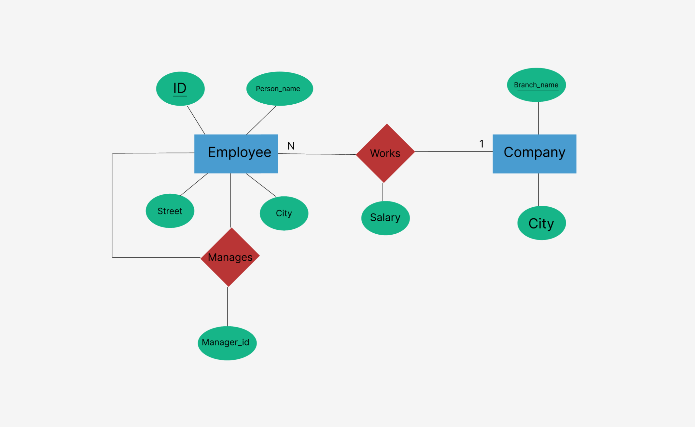

 

## Question 1
### 1(a)
Explain the distinctions among the terms primary key, candidate key, and superkey using a real-life example.
In a relation schema R = (A, B, C, D); AC as well as BCD can minimally identify each tuple in the relation.
Find the number of different keys and what are those keys?

### Answer:

| Key Type     | Definition | Real-Life Example |
|--------------|------------|-------------------|
| **Superkey** | Any combination of attributes that uniquely identifies a tuple. | In a student table with (student_id, email, phone_number):<br> - `{student_id}`<br> - `{student_id, email}`<br> - `{student_id, phone_number}`<br> - `{email, phone_number}` |
| **Candidate Key** | A minimal superkey (no proper subset is also a superkey). | - `{student_id}`, `{email}`, `{phone_number}` (assuming all unique) |
| **Primary Key** | A selected candidate key used as the main identifier. | If `{student_id}` is chosen from candidate keys, it becomes the primary key. |

**Key Differences:**
- Every **primary key** is a **candidate key**, but not every candidate key is a primary key.
- Every **candidate key** is a **superkey**, but not every superkey is a candidate key.

---

**Given:**  
- `{A, C}` and `{B, C, D}` are **candidate keys**.

These are **minimal identifiers**, meaning they are minimal superkeys.

**Candidate Keys:**
- `{A, C}`
- `{B, C, D}`

**Superkeys** (supersets of candidate keys):
- From `{A, C}`: `{A, C}`, `{A, B, C}`, `{A, C, D}`, `{A, B, C, D}`
- From `{B, C, D}`: `{B, C, D}`, `{A, B, C, D}`

**✅ Final Answer:**
- **Number of different super keys:** `5`
- **Super Keys:** `{A, C}`, `{A, B, C}`, `{A, C, D}`,`{B, C, D}`, `{A, B, C, D}`
- **Number of different candidate keys:** `2`
- **Candidate Keys:** `{A, C}`, `{B, C, D}`

---

 

### 1(b) 

Consider the relational database below, where the primary keys are underlined. Consider each manager is also in an employee.

 
employee(<u>ID</u>, person_name, street, city)  
works(<u>ID</u>, branch_name, salary)  
company(<u>branch_name</u>, city)  
manages(<u>ID</u>, manager_id)

Give an expression in SQL for each of the following:

- I. Modify the database so that the employee whose ID is ‘12345’ now works in a branch located in 'Newtown'.
- II. Give each manager of “First Bank Corporation” a 10% raise unless the salary becomes greater than Tk 100000; in such cases give only a 3% raise.
- III. Draw an E–R diagram for the above relational schema and indicate the key and participation constraints.
 

### Answer;


#### I. Update the employee with ID `'12345'` to work at a branch located in **"Newtown"**

Multiple branch in Newtown

```sql
UPDATE works
SET branch_name = (
  SELECT branch_name
  FROM company
  WHERE city = 'Newtown'
  FETCH FIRST 1 ROWS ONLY
)
WHERE ID = '12345';

```
Only One branch in Newtown
```sql
UPDATE company
SET city = 'Newtown'
WHERE branch_name = (
    SELECT branch_name
    FROM works
    WHERE ID = '12345'
);
```
---

#### II. Increase salary for managers of "First Bank Corporation"

```sql
UPDATE works
SET salary = 
  CASE 
    WHEN salary * 1.10 <= 100000 THEN salary * 1.10
    ELSE salary * 1.03
  END
WHERE ID IN (
  SELECT m.ID
  FROM manages m
  JOIN works w ON m.ID = w.ID
  JOIN company c ON w.branch_name = c.branch_name
  WHERE c.branch_name = 'First Bank Corporation'
);
```
Another way to do it:
```sql
UPDATE works
SET salary = CASE 
               WHEN salary * 1.10 <= 100000 THEN salary * 1.10
               ELSE salary * 1.03
             END
WHERE ID IN (
    SELECT m.ID
    FROM manages m
    JOIN works w ON m.ID = w.ID
    WHERE w.branch_name = 'First Bank Corporation'
);
```

---

#### III. ER Diagram Description  



---

### 1(c)

For the query "Find the names of each instructor, along with their salary and the average salary in their department", you plan to use the following query using lateral clause:


**Original with LATERAL:**
```sql
SELECT name, salary, avg_salary  
FROM instructor i1,  
LATERAL (
  SELECT AVG(salary) AS avg_salary  
  FROM instructor i2  
  WHERE i2.dept_name = i1.dept_name
);
```

Unfortunately, Oracle does not support lateral clause. So, convert the query using with clause and also convert the query as scalar sub-query.

### Answer:

#### (i) Rewrite using a WITH clause:
```sql
WITH dept_avg AS (
  SELECT dept_name, AVG(salary) AS avg_salary
  FROM instructor
  GROUP BY dept_name
)
SELECT i.name, i.salary, d.avg_salary
FROM instructor i
JOIN dept_avg d ON i.dept_name = d.dept_name;
```

#### (ii) Rewrite using a scalar sub-query:
```sql
SELECT name, salary,
  (SELECT AVG(salary)
   FROM instructor i2
   WHERE i2.dept_name = i1.dept_name) AS avg_salary
FROM instructor i1;
```

---

### 1(d)

Mention reasons why null values might be introduced into a database?

### Answer:

1. **Unknown Information** – e.g., a student’s phone number not provided.
2. **Not Applicable** – e.g., spouse_name for an unmarried person.
3. **Pending Information** – e.g., a grade that is yet to be assigned.
4. **Missing Data Due to Entry Error** – unintentional omission during data entry.

---

### 1(e)

Write an SQL query using the university schema to find the ID of each student who has never taken a course at the university.Use outer join to write the query.

```sql
SELECT s.ID
FROM student s
LEFT OUTER JOIN takes t ON s.ID = t.ID
WHERE t.course_id IS NULL;
```

Another way:

```sql
SELECT s.ID
FROM student s
WHERE NOT EXISTS (
    SELECT 1
    FROM takes t
    WHERE t.ID = s.ID
);
```

```sql
SELECT ID
FROM student
WHERE ID NOT IN (
    SELECT ID
    FROM takes
    WHERE ID IS NOT NULL
);
```
```sql
SELECT ID
FROM student
MINUS
SELECT ID
FROM takes;

```


