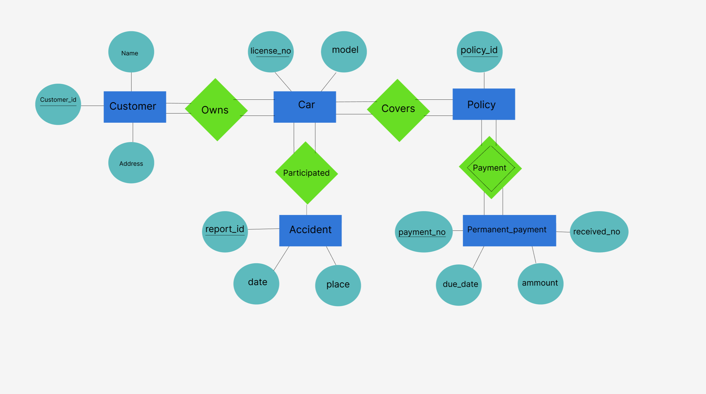
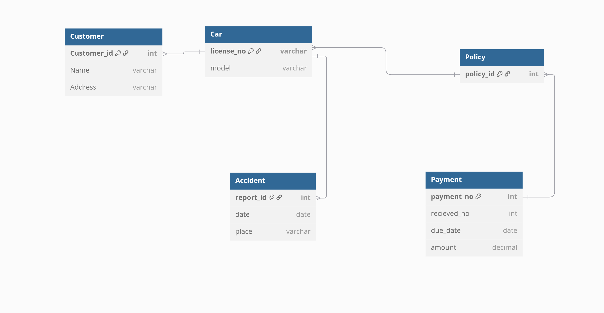
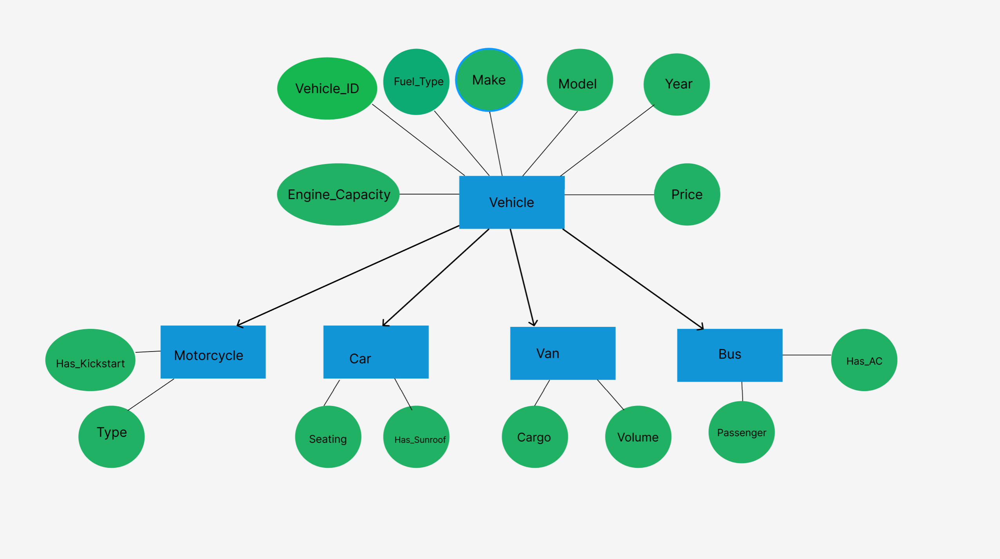

## Question 2
### 2(a)

**Question:**

**Explain the difference and relationship between a weak and a strong entity set.**

**Answer:**

A strong entity set has a primary key and can exist independently. A weak entity set lacks a primary key and depends on a strong entity for identification. Weak entities are linked to strong entities through an identifying relationship and use a partial key combined with the strong entity's key to form a unique identifier.

---

### 2(b)
**Question:**

**Convert the following E-R diagram to schema diagram**



**Answer:**



---

### 2(c)
**Question:**

**Consider a many-to-one relationship R between entity sets A and B. Suppose the relation created from R is combined with the relation created from A. In SQL, attributes participating in a foreign key constraint can be null. Explain how a constraint on total participation of A in R can be enforced using not null constraints in SQL.**

**Answer:**

In a many-to-one relationship \( R \) from entity set \( A \) to \( B \), each entity in \( A \) is associated with at most one entity in \( B \), but multiple entities in \( A \) may relate to the same entity in \( B \).

If entity set \( A \) has total participation in the relationship \( R \), it means that every entity in \( A \) must participate in the relationship, i.e., each entity in \( A \) must be associated with some entity in \( B \).

In SQL, this total participation constraint can be enforced using a combination of a foreign key and a `NOT NULL` constraint. Specifically:

- The foreign key attribute in table \( A \), which references the primary key of table \( B \), is used to represent the relationship \( R \).
- To ensure total participation, this foreign key attribute must be declared with the `NOT NULL` constraint.

This ensures that no tuple in \( A \) can exist without being related to a tuple in \( B \), effectively enforcing the total participation constraint.

```sql
CREATE TABLE B (
    B_id INT PRIMARY KEY
    -- other attributes
);

CREATE TABLE A (
    A_id INT PRIMARY KEY,
    B_id INT NOT NULL, -- ensures total participation
    -- other attributes
    FOREIGN KEY (B_id) REFERENCES B(B_id)
);
```
Here, the B_id column in table A represents the many-to-one relationship to B. The NOT NULL constraint ensures that each record in A must have a corresponding B_id, fulfilling the total participation requirement.

### 2(d)
**Question:**

**Design a generalization-specialization hierarchy for a motor vehicle sales company. The company sells motorcycles,passenger cars,vans and buses. Justify your placement of attributes at each level of the hierarchy. Explain why the should not be placed at a higher or lower level.**

**Answer:**

### Generalization-Specialization Hierarchy Design:



#### Explanation of the Hierarchy

- **Superclass (Vehicle):**
  - Represents the common attributes shared by all types of vehicles.
  - Attributes include:
    - `Vehicle_ID`: Primary key to uniquely identify each vehicle.
    - `Make`, `Model`, `Year`, `Price`, `Engine_Capacity`, `Fuel_Type`: General attributes applicable to all vehicles.

- **Subclasses:**
  - Specialized entities inheriting attributes from the `Vehicle` superclass.
  - Each subclass contains attributes specific to its type:
    - **Motorcycle:**
      - `Type`: Specifies the type of motorcycle (e.g., sports, cruiser).
      - `Has_Kickstart`: Indicates if the motorcycle has a kickstart feature.
    - **Car:**
      - `Seating_Capacity`: Number of seats in the car.
      - `Body_Style`: Style of the car body (e.g., sedan, hatchback).
      - `Has_Sunroof`: Indicates if the car has a sunroof.
    - **Van:**
      - `Cargo_Volume`: Volume of cargo space available.
      - `Sliding_Door`: Indicates if the van has sliding doors.
    - **Bus:**
      - `Passenger_Capacity`: Maximum number of passengers the bus can carry.
      - `Has_AC`: Indicates if the bus has air conditioning.
      - `Route_Type`: Type of route the bus operates on (e.g., city, intercity).

#### Justification of Attribute Placement

- **Superclass (Vehicle):**
  - Attributes placed here are common to all vehicle types, ensuring data reusability and avoiding redundancy.
- **Subclasses:**
  - Attributes specific to a particular vehicle type are placed in the corresponding subclass to maintain normalization and relevance.
  - This design avoids null values in irrelevant fields and ensures that each subclass only contains attributes pertinent to its type.

#### Benefits of the Design

1. **Reusability:** Common attributes are defined once in the superclass.
2. **Extensibility:** New vehicle types (e.g., "Truck") can be added easily without modifying existing structures.
3. **Normalization:** Prevents unnecessary null values by keeping attributes specific to their respective subclasses.


